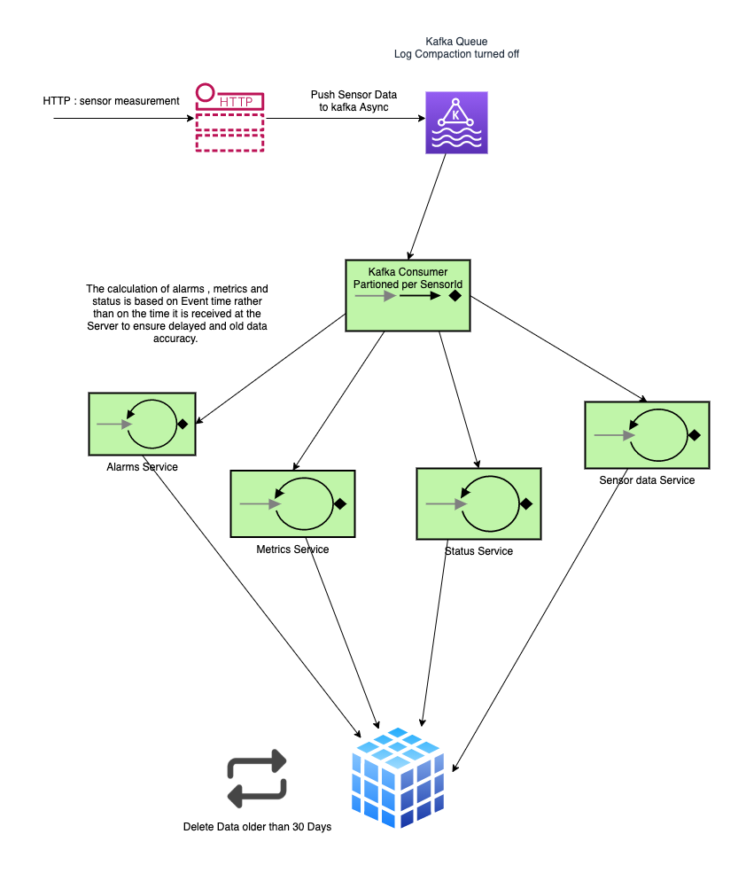

### IOT application for collecting sensor metrics
The application is a demo of a kotlin project for a IOT application where the metrics can be collected from sensors

### Architecture
> 
### Local settings
[ktlint setup](https://ktlint.github.io/#getting-started)

[Detekt setup](https://arturbosch.github.io/detekt/cli.html)

#### Building the project
`./gradlew clean build`
The above command will run the `unit tests`, `functional tests` and all the dependencies within docker containers.

#### Start the service
`./gradlew composeUp`

This will satrt the service running in docker container and exposing the port `8080` at `localhost` for testing.

## Local Ports
`postgres : 5432`
`Service : 8080`
`Kafka: 9092`

## Kafka

### Log events to console from docker container
    - kafka-console-consumer.sh  --bootstrap-server kafka:9092 --topic events-test

### Log events to docker console from container 
    - Kafka instance -> Exec -> `/bin/bash` (or from console: `docker exec -it docker_kafka_1 /bin/bash`)
    - kafka-console-consumer.sh  --bootstrap-server localhost:9092 --topic events-test

### Functional testing locally

In order to run tests locally docker env should be running. To do that run:
    
    ./gradlew functionalTest
### Improvement
###### We can have a Apache flink or Kafka SQL do a windowing of 30 days to calculate the metrics efficiently
